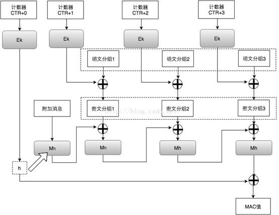
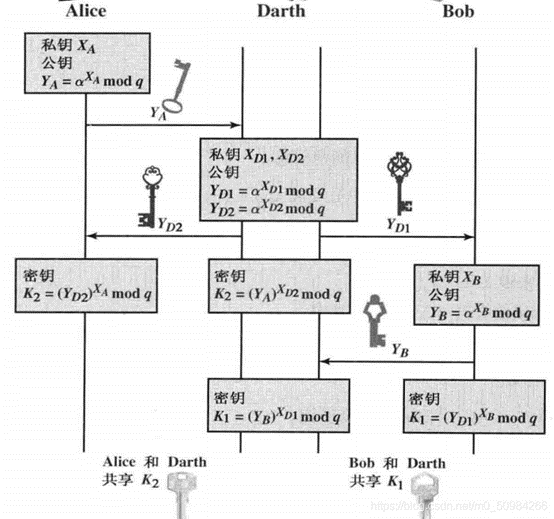

# AES-MIM

Diffie-Hellman交换密钥，AES256-GCM加密通信，利用arp欺骗、pcap和libpcap实现的中间人攻击演示程序。

## Usage

1. 看/修改代码，编译

```shell
make all
```

2. 看代码，运行


代码写的很简洁了

## Stage 1：DH交换密钥，AES256-GCM加密正常通信实现

本阶段主要为AES256-GCM 加密的设计与Diffie-Hellman 协议的实现。

### 服务器与客户端

在本次实验中，服务器为一个echo server，会将客户端发来的数据不做任何修改就返回。两者的socket 使用TCP 协议，流式套接字无法保证一次接收到所有的数据，为此服务端和客户端都采用的固定接收N 个字符，同时写入N个字符，即实现了writen() 与 readn() 函数。


**客户端主程序流程**

1. 进行 Socket 连接，成功连接上服务器后进行下一步，否则退出；
2. 生成大素数 p 和原根 g，并发送给服务器
3. 生成客户端私钥a，并结合 p 和 g 计算出客户端公钥；
4. 接收服务器的公钥并保存，发送客户端公钥给服务器；
5. 根据服务器公钥、素数 p 和客户端私钥计算出最终用于 AES 加解密的密钥；
6. 接收用户数据，加密后发送数据给服务器端；
7. 接收服务器发送的密文，并解密输出；
8. 重复 6 和 7，直到连接中断。


**服务器主程序流程**

1. 创建 Socket 连接，当有客户端连接时，接收素数 p 和原根 g;
2. 生成服务器私钥，并计算出公钥，发送给客户端；
3. 接收客户端的公钥，并计算出用于 AES 加解密的密钥；
4. 等待客户端发送的密文，并进行解密和输出；
5. 明文内容加密后再将密文发送给客户端；
6. 重复 4 和 5，直到连接中断。


### Diffie-Hellman 协议实现

**Diffie-Hellman 协议的大致流程：**

1. Alice和Bob先对p 和g达成一致，而且公开出来。Eve也就知道它们的值了。
2. Alice取一个私密的整数a，不让任何人知道，发给Bob 计算结果：A=g^a mod p. Eve 也看到了A的值。
3. 类似,Bob 取一私密的整数b,发给Alice计算结果B=g^b mod p.同样Eve也会看见传递的B是什么。
4. Alice 计算出$ S= B^a mod p= (g^b)^a mod p =g^{(ab)}mod p.$
5. Bob 也能计算出$ S= A^b mod p = (g^a)^b mod p =g^{(ab)}mod p. $
6. Alice 和 Bob 现在就拥有了一个共用的密钥S.

虽然Eve看见了p, g, A and B, 但是鉴于计算离散对数的困难性，她无法知道a 和b 的具体值。所以Eve就无从知晓密钥S 是什么了。


### AES256

#### 关于密码学：

该部分代码在DH.c和DH.h中。

**大随机数：**
鉴于 `libgmp` 库中的随机数生成程序在范围上有限制，于是使用了Linux 系统提供的真随机数生成` /dev/random`。其通过放大器放大电压波动，从而产生一系列的随机比特流。因为需要使用 `libgmp`进行大数运算，所以还要将其转换为 `mpz_t` 格式变量。

**大素数：**
当我们生成了一个随机大数后，使`libgmp`中的 `mpz_nextprime` 寻找下一个素数，但这个数不一定为素数，所以还要使用 `mpz_probab_prime_p` 进行素性检测。返回1代表可能为素数，2代表绝对是素数，0代表绝对不是素数。
通过上述两个方法，加上gmp库的帮助我们就可以解决大部分密码学运算问题， 


### AES-GCM

> 这部分代码是我自己写的，我参考了一些其他实现，发现跟自己所学的不完全一致。所以，我坚持了自己的理解，如果你仔细阅读代码可以看到。所幸没有出现问题。人们都说，自己实现加密是一件不安全的事，确实，这样看我的加密与标准不同，密文只能被自己的解密解出来了，hhhh。





GCM模式没有直接对明文使用AES加密，而是对计数器加密，再与明文异或。此处的计数器也称为nonce或iv向量，并包含一个每次加密都增加的 cnt 确保每轮使用不用的数据异或。其中的Mac值即为初始计数器，附加消息和密文的校验和。
AES加密以128位为一个块进行加密，所以在加密前要先将输入的大小进行字节对齐
`size_t n_blk = ((in_size + 0x10 - 1) & (~(0x10 - 1)))/0x10;`
在一次AES-GCM加密时，nonce会重复使用，所以在加解密结束后要清理ctr的cnt以便于下次使用。

为了方便使用将AES的代码进行了封装：

1. `uint8_t *AES_init(uint8_t *key,size_t key_size)`: 输入key及其字节大小，该函数会为你申请扩展密钥所需内存，并进行密钥扩展，最后返回包含密钥扩展的内存指针。在AES256中密钥为256位即32字节。
2. `void AES_free(uint8_t *key)`：释放掉扩展密钥的内存。
3. `void AES_gcm_encrypt(void *in, size_t in_size, void *out, void *w, void *msg,void *m)`：AES加密总函数
4. `void AES_gcm_decrypt(void *in, size_t in_size, void *out, void *w)`：AES解密总函数


## Stage 2：ARP欺骗，中间人实现

### ARP欺骗实现：

中间人和客户端与服务器在同一局域网中。客户端会先在局域网内进行广播查询服务端的MAC，服务器会返回ARP reply 告知客户端自己的MAC。同理，服务端也知道了客户端的MAC，二者即可使用MAC通信不需要经过网关。这里有一个致命的缺陷，ARP协议不检查ARP reply的真实性。
为此，中间人不断向客户端发送ARP reply谎称自己是服务器，向服务端谎称自己是客户端，修改了客户端和服务端的arp表，这样所有的数据都会发给中间人。而客户端和服务端如果不进行仔细的检查是无法发现中间人的存在的。


### 中间人的实现：

正常情况下，我们无法获得不是发给我们的数据，这里我们通过 libcpcap 利用bpf过滤所有客户端与服务器的tcp数据，并将其copy下来进行处理。
主要流程为：

1. `pcap_lookupdev()`: 获取可用的网络设备名指针；
2. `pcap_open_live()`: 打开指定的网络设备，并返回用于捕获网络数据包的描述字；
3. `pcap_compile()`: 将用户制定的 BPF 过滤规则编译到过滤程序当中；
4. `pcap_setfilter()`: 应用 BPF 过滤规则，让过滤规则生效；
5. `pcap_loop()`: 循环抓包，遇到错误或者执行结束时退出。


#### 中间人密钥获取流程





    中间人生成自己的私钥。进行数据处理，如果获得的是素数p则进行保存，不做任何修改直接发送给服务器。如果是客户端公钥，则计算中间人与客户端的共享密钥，并将自己的公钥发送给服务器。如果收到的是服务器公钥，则计算中间人服务器的共享密钥，并将自己的公钥发送给客户端。这样中间人拥有了两个共享密钥，可以解密来自任何一方的数据。


## Stage 3：身份验证防止中间人攻击

> 一个学长使用psk来防止中间人，我也实现了一下，但是仔细想想发现不太对。即使中间人不知道你发的什么东西，只要无脑转发过去就可以通过psk的认证！所以我才采取了另一种方法。


    DH密钥交换无法防止中间人攻击，原因之一在于没有对身份进行验证。无论是谁发来的公钥都接受。改进该算法就要加入身份认证。我使用的是签名技术，为了简化实现，我是用了Hash签名。
    实际上，RSA和DSA签名才是最好的选择。这里我们假设中间人不知道我们使用的什么算法，而客户端和服务端已经预定好，这么做是为了代替非对称密钥签名中密钥已被交换的情况，即服务器与客户端已经相互认识，在通信过程中再次验证与之通信的是否是对方。
在交换完成密钥后，客户端将服务器的公钥进行Hash 标志为msg并加密发送出去。中间人截获了报文却不知道这是什么含义，看到标志为msg就不做修改转发了出去。服务器收到后，对自己的公钥进行Hash并与收到的Hash进行比较，由于中间人的加入，客户端的服务器公钥其实是中间人的公钥自然与服务器真实的公钥不符合，身份认证失败服务器中断连接。


## ref

[GitHub - abdularis/arpspoof: ARP spoofer, for linux](https://github.com/abdularis/arpspoof)


